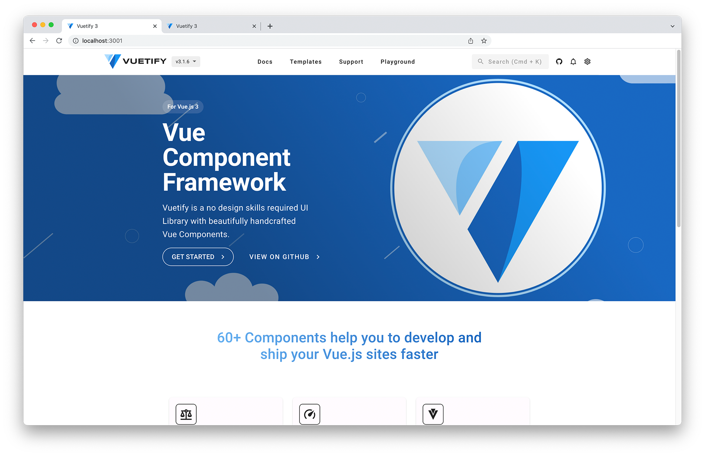

# Vuetify Docs POC
>
> 💡 A draft for alternative vuetify docs with a completely restructured and redesigned layout & navigation.
> This is neither fully designed, nor responsive as it's just a poc.
>

This project contains a re-work of the vuetifyjs docs showing structural reworks. With the re-structured navigation things will be easier to find and the menu + toolbar end up less cluttered.

## 📷 Screenshots



## Project setup

```
# yarn
yarn

# npm
npm install

# pnpm
pnpm install
```

### Compiles and hot-reloads for development

```
# yarn
yarn dev

# npm
npm run dev

# pnpm
pnpm dev
```

### Compiles and minifies for production

```
# yarn
yarn build

# npm
npm run build

# pnpm
pnpm build
```

### Customize configuration

See [Configuration Reference](https://vitejs.dev/config/).
