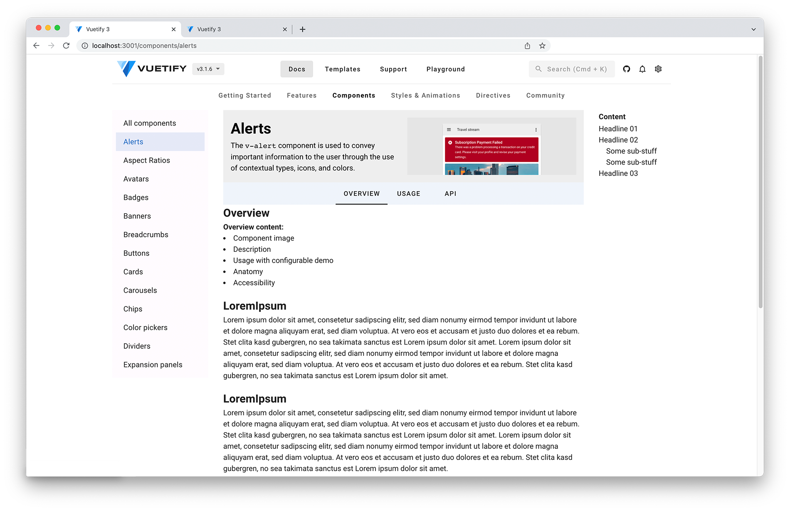

# Vuetify Docs POC
>
> 💡 A draft for alternative vuetify docs with a completely restructured and redesigned layout & navigation.
> This is neither fully designed, nor responsive as it's just a poc.
>

This project contains a re-work of the vuetifyjs docs showing structural reworks. With the re-structured navigation things will be easier to find and the menu + toolbar end up less cluttered.

## Changes
The following 
- Homepage: 
  - [ ] Add more information about the framework, show off some components and store products (starter templates)
  - [ ] Link to docs in Nav
- Header
  - [x] Declutter Toolbar: way too many submenus. Move Languages and theme-toggle into the settings drawer 
  - [x] New version selection
  - [ ] Change search-Short code to cmd+k / strg+k ("new" docs standard in the vue universe and a lot more)
  - [x] Rename `shop` to `templates` (people literally LOVE great templates, just look at talwindUI)
  - [ ] Shrink on scroll
  - [x] Full menu rework(remove duplicate entries and different naming for the same thing, move stuff to different subpages)
- Sidebar
  - [x] Settings sidebar: cleanup design, include more stuff like Language switch
- Docs
  - [ ] Point out the differences between components (e.g Ap-Bar vs Toolbar)
  - [x] Remove grouping in component-list (e.g Forms)
  - [x] Split component-pages in subpages: 
    - [x] Overview
    - [x] Usage
    - [x] API (The integration of the subcomponents-API still needs a better solution. Alternative: Don't display the component subpages as tabs - instead use sub-list in the sidebar including the APIs. [Draft: play.vuetifyjs.com](https://play.vuetifyjs.com/#eNq9VU1v2zAM/SuCL26B2O7QHQYvLdrddhg2YNgpzkGxlUSr9QGJTlsE+e+jJDt2nDRLd5iBwDL5yEc+UcpsGz1qnW4aFuXRFJjQNQV2X0hCppukpKZyS0LKmlp7V0TiJaENqCIK5mdewRrNtzc3weQjfWzNLZBNIlTF6lxpJlmFQLcooha1xyUroxqN6KUyCLoqldBKMgkTwmXFXq7xRfZGW0Qk39C6YYj1/kFGzNl1gflsrSCnJfANBZ96S7RR2pLdQciwFI7hhx6CiRbIg+E+uGu+f3LgULtq9jWmkgo2Bt5PswHJsORsoPzAfKDOmZbPVb8X1TYLwWRzUtK0XPO6Mm5vDqPzJ/baU458Xddt5pM9j6sees/oMey8n5ZT5s4YZhY/3NDix0jTqS0N10AsgxBaAMfmDZAtMWxJdmRplCAxnoT4MwZAqSQOsJtXcucQV7P4l2XGxvNr9GN4ANBKcGkRMgvlzOJvVNIVQ0EgnpBYVDyhZakaCYloauC6ZolqoOaSxfNJF/STAXC5sl1IqVYj1Nyxku4XyPsj0RewDa8C3G7kJH6smQHM24kICo1ZH5lRD8jUhpkNZ889spuJvEs9SB+eluL7Uej7iAjZDdanGB5/fL0sOdX8IG+37JTuiMYqfaFSus19W6ZFQPwHnZCJyZNMFwnlbitf699pfENjyd7BkAB7wSm/lOYI/sb2hFGfZuHI4mGNJlE4rImgOv1tlcR/K18c3ivegZdyvt/UCA+x+y6iNYC2eZY1Uj+tUqwqe0BfZvA0csGSSomH2/Q2vUlordc0/ZhVeJMM3SmzIlkY9YxHH4mLqC3UcwBfvr7F07ox/Yf0U0jbmpKaLqzLe5QvQxLc8wRnqWKGmbM9jLCn+hhBjnpx1LgFO5QXL5onO1K2tF7Vdqj/pUmfwe+oY9lNooMikdYHRvM/PASZiQ==))


## 📷 Screenshots




## Project setup

```
# yarn
yarn

# npm
npm install

# pnpm
pnpm install
```

### Compiles and hot-reloads for development

```
# yarn
yarn dev

# npm
npm run dev

# pnpm
pnpm dev
```

### Compiles and minifies for production

```
# yarn
yarn build

# npm
npm run build

# pnpm
pnpm build
```

### Customize configuration

See [Configuration Reference](https://vitejs.dev/config/).
